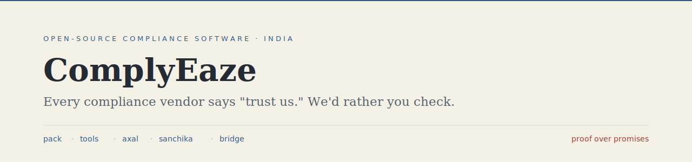

<picture>
  <source media="(prefers-color-scheme: dark)" srcset="assets/banner-dark.svg">
  <source media="(prefers-color-scheme: light)" srcset="assets/banner-light.svg">
  
</picture>

### Every compliance vendor says "trust us." We'd rather you check.

I'm **Tapish Khandelwal**. I build **[ComplyEaze](https://complyeaze.com)** - open-source software for India's compliance professionals, primarily CA firms.

India runs compliance at machine scale: 69,000+ distinct obligations across 1,536 Acts¹, AI-flagged mismatches, notices by the lakh. It lands on roughly 1.55 lakh full-time practicing CAs² - most of them in single-partner firms who answer it one portal login, one captcha, one PDF at a time.

Their software forces a bad trade: desktop tools from another decade, or cloud platforms that ask for blind trust with the most sensitive commercial data in India. We're building the third option: tools that state their trust boundary, ship with evidence, and keep their source public.

#### The product family

| Product | What it is | Trust boundary | Stage |
|---|---|---|---|
| **[pack](https://github.com/lamemustafa/pack)** | Chrome extension that downloads your filed GST returns to your own machine | **Local-only.** No account, no credential handoff, no upload, no telemetry | [Chrome Web Store](https://chromewebstore.google.com/detail/nfnbhekccajjfgkppolomflaeledoccb) · open-source alpha |
| **[complyeaze-tools](https://github.com/lamemustafa/complyeaze-tools)** | Browser-local utilities that turn messy records into review-ready drafts | **Browser-local.** Files never leave your browser; no account | Live at [tools.complyeaze.com](https://tools.complyeaze.com) |
| **[bridge](https://github.com/lamemustafa/bridge)** | Tauri desktop bridge for local-edge Tally, GST, DSC, document, and Axal sync workflows | **Local-edge.** Runs on your machine | Early development |
| **[Axal](https://axal.complyeaze.com)** | The compliance workspace for firms: client, obligation, evidence, owner, deadline in one view | **Cloud, tenant-scoped.** The one product where data lives on our servers - so it can do what local tools can't: cross-deadline visibility and insight. Stated plainly, scoped by workspace and role | Live · open-source release planned |
| **[sanchika](https://github.com/lamemustafa/sanchika)** | AI-native design-system SDK that keeps professional judgment visible in compliance interfaces | **SDK.** No model runtime, no data custody | v0.0.x · early |
| **[complyeaze-public](https://github.com/lamemustafa/complyeaze-public)** | Website, trust, release, policy, and brand surfaces for the family | **Public by design** | Live |

#### How we work

- **Trust boundaries are stated per product, never averaged across the brand.** Pack and Tools never see your data. Axal does - and says so on the box. You should never have to guess which kind of tool you're holding.
- **Claims ship with evidence.** Releases are tagged and checksummed; packages are verified by script before they're claimed; public pages don't outrun recorded release evidence. Stage labels (alpha, early, live) are part of the product, not fine print.
- **Open source is the trust model, not a marketing channel.** For software that sits next to GST credentials, PAN, and client financials, "read the code" is the only claim that doesn't require believing us.

ComplyEaze is independent - not affiliated with, endorsed by, or operated by GSTN, CBIC, MCA, or the Government of India.

¹ [TeamLease RegTech](https://teamleaseregtech.com) regulatory database. ² ICAI membership data, 2025 - ~4.23 lakh active CAs, ~1.55 lakh holding full-time Certificate of Practice.

---

**complyeaze.com** · [Axal](https://axal.complyeaze.com) · [Pack](https://pack.complyeaze.com) · [Tools](https://tools.complyeaze.com) · [Sanchika](https://sanchika.complyeaze.com) · [LinkedIn](https://www.linkedin.com/in/tapishkhandelwal/)
